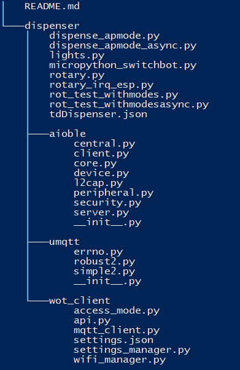
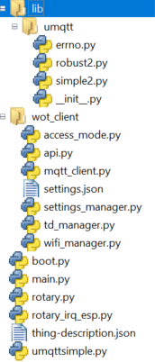

# PWPHardwareMonkeys

This project consists of two WoT devices. The files for the esp32 can be found in the mixer / dispenser folders.

##  Dispenser

### Requirements

To use the dispenser you need:

- ESP32 (flashed with micropython -> main logic)
- ESP01s (flashed with arduino -> handles button and servo motor logic)
- Switchbot
- Rotary Switch
- Keyboard Switch (Kailh box jade or similar)
- Light Sensor (tsl2591 or similar)
- Cables
- Either Screws, Glue or a Soldering iron to assemble the dispenser
- 3d Printed Parts [STL Files](dispenser/dispenser_stls)

Optionally:
- Ws2812b LED Strip
- Usb-C breakout board for esp01 for easier power delivery

### Structure

### Components / Interfaces
The dispenser has 3 main features

1. [MQTT interface](dispenser/wot_client/api.py) maintained by the modes & communication group 
2. [Switchbot interface](dispenser/micropython_switchbot.py) which can be accessed via API or Bluetooth
3. [Rotary encoder](dispenser/rotary_irq_esp.py) for switching the four security states

### Setup

1. Print and assemble dispenser 
2. Flash esp32 with micropython and wire components to the esp32 (GND and 3.3V/5V can be daisy chained between components)
    1. Connect rotary encoder (clk/s1 = gpio27, dt/s2 = gpio26)
    2. Connect Light sensor to scl and sda (predefined as 5 and 4, but can be changed inside of the tsl2591 python module in line 55)
    3. Optionally: Connect LED Strip to gpio25
3. Copy files on root directory of the esp
4. Configure Wifi credentials in [settings.json](dispenser/wot_client/settings.json)
5. Configure Switchbot bluetooth mac address in [micropython_switchbot.py](dispenser/micropython_switchbot.py) in line 39
6. Run [main.py](dispenser/main.py) on esp
7. Follow instructions of the selected security mode
8. Copy arduino code onto the esp01s and wire components 
    1. connect keyboard switch to gpio2
    2. connect servo motor to gpio0

## Mixer

### Requirements

To use the mixer you need:

- ESP32 (flashed with micropython)
- LEDs
- Rotary Switch
- Mixer
- Cables
- Resistors

### Structure

### Components / Interfaces
The Mixer has 2 main features

1. [MQTT interface](mixer/wot_client/api.py) maintained by the modes & communication group 
2. [Rotary encoder](mixer/rotary_irq_esp.py) for switching the four security states
2. [Switchbot interface](mixer/main.py) which can be accessed via API

### Setup

1. Flash esp with micropython
2. Copy files on root directory of the esp
3. Configure Wifi credentials in [settings.json](mixer/wot_client/settings.json)
4. Run [main.py](mixer/main.py) on esp
5. Follow instructions of the selected security mode