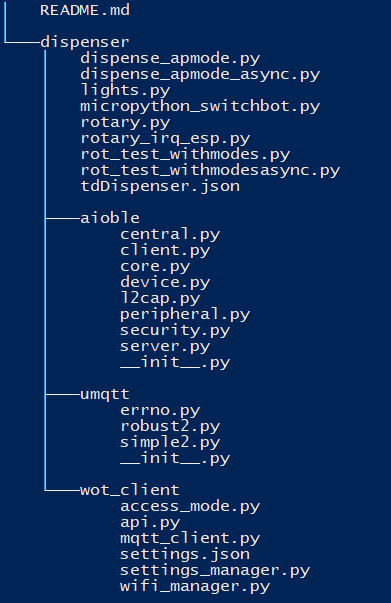

# PWPHardwareMonkeys

This project consists of two WoT devices. The files for the esp32 can be found in the mixer / dispenser folders.

##  Dispenser

### Requirements

To use the dispenser you need:

- ESP32 (flashed with micropython)
- Switchbot
- Rotary Switch
- 3d Printed Parts [STL Files](dispenser/dispenser_stls)

### Structure

### Components / Interfaces
The dispenser has 3 main features

1. [MQTT interface](dispenser/wot_client/api.py) maintained by the modes & communication group 
2. [Switchbot interface](dispenser/micropython_switchbot.py) which can be accessed via API or Bluetooth
3. [Rotary encoder](dispenser/rotary_irq_esp.py) for switching the four security states

### Setup

1. Flash esp with micropython
2. Copy files on root directory of the esp
3. Configure Wifi credentials in [settings.json](dispenser/wot_client/settings.json)
4. Run [main.py](dispenser/main.py) on esp
5. Follow instructions of the selected security mode

## Mixer
